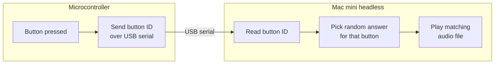

# prompts-to-speech

Fake it till you make it.

Five push-buttons, each mapped to a set of canned answers.
Press a button and the system speaks a random answer for it through a speaker.
The voice lines are synthesised by ElevenLabs ahead of time and played back offline.

## How it works

A microcontroller reads the buttons and reports each press over USB serial. A headless
Mac mini does everything else: Picks a random answer for the button and plays its
pre-rendered audio file.



## Components

| Part | What it is |
|------|------------|
| `main.py` | Offline runtime: reads serial, picks an answer, plays its audio file. |
| `generate_audio.py` | Pre-renders every line to `audio/` via ElevenLabs (run once, online). |
| `config.py` | Shared config loader and audio-filename logic. |
| `launchagent.py` | Installs the launchd agent that runs `main.py` on boot. |
| `prompts.toml` | Button to prompts to answers mapping. |
| `audio/` | Pre-rendered voice lines (committed, so it runs offline anywhere). |
| `firmware/` | Controller firmware for the Pico and the Arduino Nano. |

## Requirements

- Mac mini with Python 3.14
- Raspberry Pi Pico / Arduino Nano + 5 buttons
- ElevenLabs API key

Python deps (`requirements.txt`): `pyserial`, `elevenlabs`, `python-dotenv`. Playback uses macOS's built-in `afplay`.

## Quick start

```bash
python3.14 -m venv .venv && source .venv/bin/activate
pip install -r requirements.txt
cp .env.example .env
python generate_audio.py
python main.py
```

Flash a controller too: see [docs/hardware.md](docs/hardware.md).

No hardware yet? Test the whole pipeline with on-screen buttons (`python main.py --debug`)
or from a phone on the same network (`python main.py --web`).

## Documentation

- [Hardware & firmware](docs/hardware.md) -> wiring, serial protocol, Pico and Nano firmware
- [Setup & configuration](docs/setup.md) -> install, `.env`, editing `prompts.toml`
- [Recording the voice lines](docs/recording.md) -> the pre-render workflow
- [Running](docs/running.md) -> usage, test modes (`--debug`, `--web`), serial auto-detection, boot on launchd
